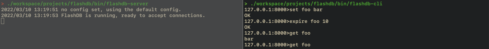

<p align="center">

</p>

# flashdb

FlashDB is a simple, in-memory, key/value store in pure Go.
It persists to disk, is ACID compliant, and uses locking for multiple
readers and a single writer. It supports redis like operations for
data structures like SET, SORTED SET, HASH and STRING. 

Features
========

- In-memory database for [fast reads and writes](#performance)
- Embeddable with a simple API
- Supports Redis like operations for SET, SORTED SET, HASH and STRING
- [Durable append-only file](#append-only-file) format for persistence
- Option to evict old items with an [expiration](#data-expiration) TTL
- ACID semantics with locking [transactions](#transactions) that support rollbacks


Architecture
=============

FlashDB is made of composable libraries that can be used independently and are easy to understand. The idea is to bridge the 
learning for anyone new on how to build a simple ACID database.


- [Set](https://github.com/arriqaaq/set)
- [ZSet](https://github.com/arriqaaq/zset)
- [String](https://github.com/arriqaaq/art)
- [Hash](https://github.com/arriqaaq/hash)
- [Append Only Log](https://github.com/arriqaaq/aol)


Getting Started
===============

## Installing

To start using FlashDB, install Go and run `go get`:

```sh
$ go get -u github.com/arriqaaq/flashdb
```

This will retrieve the library.


## Opening a database

The primary object in FlashDB is a `DB`. To open or create your
database, use the `flashdb.New()` function:

```go
package main

import (
	"log"

	"github.com/arriqaaq/flashdb"
)

func main() {
	config := &flashdb.Config{Path:"/tmp", EvictionInterval: 10}
	db, err := flashdb.New(config)
	if err != nil {
		log.Fatal(err)
	}
	defer db.Close()

	...
}
```

It's also possible to open a database that does not persist to disk by keeping the path in the config empty.

```go
config := &flashdb.Config{Path:"", EvictionInterval: 10}
flashdb.New(config)
```

## Transactions
All reads and writes must be performed from inside a transaction. FlashDB can have one write transaction opened at a time, but can have many concurrent read transactions. Each transaction maintains a stable view of the database. In other words, once a transaction has begun, the data for that transaction cannot be changed by other transactions.

When a transaction fails, it will roll back, and revert all changes that occurred to the database during that transaction. When a read/write transaction succeeds all changes are persisted to disk.

### Read-only Transactions
A read-only transaction should be used when you don't need to make changes to the data. The advantage of a read-only transaction is that there can be many running concurrently.

```go
err := db.View(func(tx *flashdb.Tx) error {
	...
	return nil
})
```

### Read/write Transactions
A read/write transaction is used when you need to make changes to your data. There can only be one read/write transaction running at a time. So make sure you close it as soon as you are done with it.

```go
err := db.Update(func(tx *flashdb.Tx) error {
	...
	return nil
})
```

### Setting and getting key/values

To set a value you must open a read/write transaction:

```go
err := db.Update(func(tx *flashdb.Tx) error {
	_, _, err := tx.Set("mykey", "myvalue")
	return err
})
```


To get the value:

```go
err := db.View(func(tx *flashdb.Tx) error {
	val, err := tx.Get("mykey")
	if err != nil{
		return err
	}
	fmt.Printf("value is %s\n", val)
	return nil
})
```

Commands
========
| String | Hash    | Set         | ZSet           |
|--------|---------|-------------|----------------|
| SET    | HSET    | SADD        | ZADD           |
| GET    | HGET    | SISMEMBER   | ZSCORE         |
| DELETE | HGETALL | SRANDMEMBER | ZCARD          |
| EXPIRE | HDEL    | SREM        | ZRANK          |
| TTL    | HEXISTS | SMOVE       | ZREVRANK       |
|        | HLEN    | SCARD       | ZRANGE         |
|        | HKEYS   | SMEMBERS    | ZREVRANGE      |
|        | HVALS   | SUNION      | ZREM           |
|        | HCLEAR  | SDIFF       | ZGETBYRANK     |
|        |         | SCLEAR      | ZREVGETBYRANK  |
|        |         |             | ZSCORERANGE    |
|        |         |             | ZREVSCORERANGE |
|        |         |             | ZCLEAR         |


Setup
=====

<p align="center">

</p>


Run the server
```go
go build -o bin/flashdb-server cmd/server/main.go
```

Run the client
```go
go build -o bin/flashdb-cli cmd/cli/main.go
```


Benchmarks
==========

* Go Version : go1.11.4 darwin/amd64
* OS: Mac OS X 10.13.6
* Architecture: x86_64
* 16 GB 2133 MHz LPDDR3
* CPU: 3.1 GHz Intel Core i7

```
badger 2022/03/09 14:04:44 INFO: All 0 tables opened in 0s
goos: darwin
goarch: amd64
pkg: github.com/arriqaaq/flashbench
cpu: Intel(R) Core(TM) i9-9980HK CPU @ 2.40GHz

BenchmarkBadgerDBPutValue64B-16     	    9940	    141844 ns/op	    2208 B/op	      68 allocs/op
BenchmarkBadgerDBPutValue128B-16    	    7701	    192942 ns/op	    2337 B/op	      68 allocs/op
BenchmarkBadgerDBPutValue256B-16    	    7368	    142600 ns/op	    2637 B/op	      69 allocs/op
BenchmarkBadgerDBPutValue512B-16    	    6980	    148056 ns/op	    3149 B/op	      69 allocs/op
BenchmarkBadgerDBGet-16             	 1000000	      1388 ns/op	     408 B/op	       9 allocs/op

BenchmarkFlashDBPutValue64B-16     	  204318	      5129 ns/op	    1385 B/op	      19 allocs/op
BenchmarkFlashDBPutValue128B-16    	  231177	      5318 ns/op	    1976 B/op	      16 allocs/op
BenchmarkFlashDBPutValue256B-16    	  189516	      6202 ns/op	    3263 B/op	      15 allocs/op
BenchmarkFlashDBPutValue512B-16    	  165580	      8110 ns/op	    5866 B/op	      16 allocs/op
BenchmarkFlashDBGet-16             	 4053836	       295 ns/op	      32 B/op	       2 allocs/op

PASS
ok  	github.com/arriqaaq/flashbench	28.947s
```

#### With fsync enabled for every update transaction

```
badger 2022/03/09 14:04:44 INFO: All 0 tables opened in 0s
goos: darwin
goarch: amd64
pkg: github.com/arriqaaq/flashbench
cpu: Intel(R) Core(TM) i9-9980HK CPU @ 2.40GHz

BenchmarkNutsDBPutValue64B-16     	      52	  20301019 ns/op	    1315 B/op	      17 allocs/op
BenchmarkNutsDBPutValue128B-16    	      63	  23496536 ns/op	    1059 B/op	      15 allocs/op
BenchmarkNutsDBPutValue256B-16    	      62	  20037952 ns/op	    1343 B/op	      15 allocs/op
BenchmarkNutsDBPutValue512B-16    	      62	  20090731 ns/op	    1754 B/op	      15 allocs/op

BenchmarkFlashDBPutValue64B-16     	      62	  18364330 ns/op	     692 B/op	      15 allocs/op
BenchmarkFlashDBPutValue128B-16    	      64	  18315903 ns/op	    1015 B/op	      15 allocs/op
BenchmarkFlashDBPutValue256B-16    	      64	  19250441 ns/op	    1694 B/op	      15 allocs/op
BenchmarkFlashDBPutValue512B-16    	      61	  18811900 ns/op	    2976 B/op	      15 allocs/op
BenchmarkFlashDBGet-16			    3599500	     340.7 ns/op	      32 B/op	       2 allocs/op

PASS
ok  	github.com/arriqaaq/flashbench	28.947s
```

The benchmark code can be found here [flashdb-bench](https://github.com/arriqaaq/flashdb-bench).


TODO
====

FlashDB is in early stages of development. A couple of to-do tasks listed:

- Add more comprehensive unit test cases
- Add explicit documentation on various usecases


References
==========

FlashDB is inspired by NutsDB and BuntDB.


## Contact
Farhan Khan [@arriqaaq](http://twitter.com/arriqaaq)

## License
FlashDB source code is available under the MIT [License](/LICENSE)
